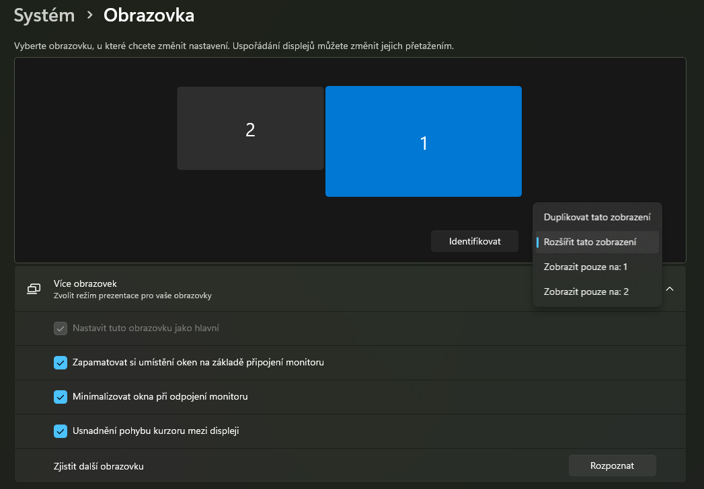
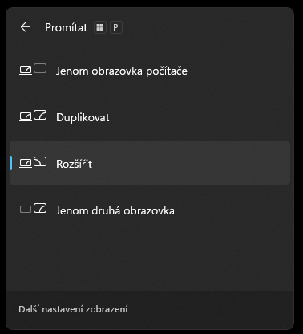

<!-- _class: title -->

# Jak prezentovat (efektivně)

🧑‍🏫 Autor: Mgr. Vojtěch Bartoš  
Licence: CC BY-NC-SA

---

# 🎯 Cíle lekce

- pochopit, proč prezentace rozhoduje o úspěchu nápadu
- rozlišit slabou a kvalitní prezentaci
- umět připravit techniku bez stresu
- nacvičit krátké vystoupení se zpětnou vazbou

---

# ℹ️ Proč byste měli umět prezentovat

- u maturity, seminárky i na pohovoru neprodáváte slidy, ale myšlenku
- nestačí „vědět hodně“ , důležité je být srozumitelný
- dobrá prezentace zvyšuje důvěru i šanci na úspěch
- kdo mluví jasně, působí profesionálněji

---

# ❌ 5 největších průšvihů v prezentaci

- přeplněné slidy bez jasné hlavní myšlenky
- čtení textu ze slidu místo skutečného výkladu
- chaos ve struktuře: publikum neví, kam směřujete
- technické zdržení, které rozbije tempo vystoupení
- nulový kontakt s publikem a monotónní přednes

---

# ℹ️ Technika, která vás podrží

- před začátkem vždy otestujte kabel a možnost připojení
- použijte režim „Rozšířit“ nebo „Duplikovat“ (kláv. zkratka `Win + P`)
- prezentační režim vám dává čas, poznámky a náhled dalších slidů
- mějte plán B: PDF v cloudu, náhradní adaptér, záložní médium

---

# ℹ️ Promítací režimy (Systém -> Obrazovka)

---

# ℹ️ Promítací režimy (kláv. zkratka `Win + P`)

---

# ℹ️ Vystoupení naživo

- řeč těla: postoj mimo kužel projektoru, oční kontakt, klidná gesta
- krizové situace: zaseknuté video, výpadek obrazu, „okno“ v textu
- v každé krizi funguje stejné pořadí: pauza → nádech → stručné shrnutí
- prezentující má řídit místnost, ne být řízen technikou

---

# ℹ️ Struktura prezentace

- začněte jasným cílem: co si má publikum odnést po skončení
- úvod (10 %): zaujmout a stručně říct, proč je téma důležité
- jádro (80 %): 2-3 hlavní body, každý podpořený příkladem nebo ukázkou
- závěr (10 %): shrnutí, hlavní sdělení a konkrétní výzva k akci
- plynulé přechody mezi částmi udržují pozornost a logiku výkladu

---

# ℹ️ Jak dávat zpětnou vazbu

- začněte tím, co fungovalo: konkrétní silná stránka prezentace
- buďte konkrétní: místo „bylo to slabé“ řekněte, co přesně zlepšit
- mluvte věcně o projevu, ne osobně o člověku
- nabídněte návrh: co udělat příště lépe a jak toho dosáhnout
- držte poměr 1:1: ocenění + doporučení ke zlepšení

---

<!-- _class: task -->

# 💼 Úkol: Týmová aktivita

🎯 **Cíl:** Okamžitě si v praxi vyzkoušet tvorbu stručné a přesvědčivé prezentace

📋 **Zadání:**

- týmy po 3 dostanou 15 minut na vytvoření přesně 3 slidů na absurdní téma
- příklady témat: „Proč jsou holubi ve skutečnosti vládní drony“ nebo „Proč by se ve škole mělo spát“
- poté má každý tým 2 minuty na výstup
- publikum hodnotí: srozumitelnost, strukturu, přesvědčivost

✅ **Výstup:**:
- tříslidová mini prezentace + stručná zpětná vazba od spolužáků

---

# 🧠 Souhrn lekce

- prezentace rozhoduje o tom, zda nápad „projde“
- nejčastější chyby jsou opravitelné
- struktura a stručnost zvyšují srozumitelnost
- technická příprava snižuje stres a chyby
- **zlaté pravidlo:** Jedna hlavní myšlenka na slide, jeden jasný cíl pro publikum

---

<!-- _class: closing -->

# Děkuji za pozornost!

🧑‍🏫 Autor: Mgr. Vojtěch Bartoš  
© Licence: CC BY-NC-SA  
Kontakt: [info@otevrenainformatika.cz](mailto:info@otevrenainformatika.cz)  
www.otevrenainformatika.cz
