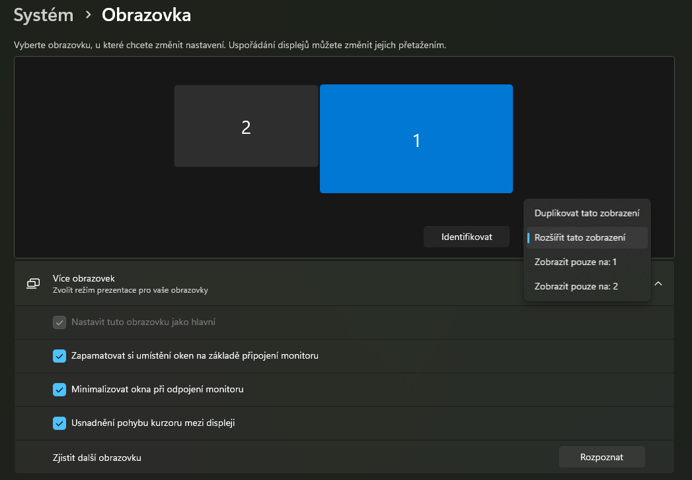
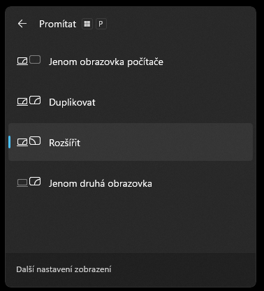

<!-- _class: title -->

# Jak prezentovat (efektivně)

🧑‍🏫 Autor: Mgr. Vojtěch Bartoš  
Licence: CC BY-NC-SA

---

# 🎯 Cíle lekce

- pochopit, proč i sebelepší myšlenku může potopit špatná prezentace
- rozlišit slabou a kvalitní prezentaci
- osvojit si ověřené postupy pro tvorbu prezentací
- umět připravit techniku bez stresu
- naučit se poskytovat vhodnou zpětnou vazbu
- nacvičit krátké vystoupení

---

# ℹ️ Proč byste měli umět prezentovat

- dobrá myšlenka nestačí, je potřeba ji umět prodat
- nestačí „vědět hodně“ , důležité je **být srozumitelný**
- kvalitní prezentace zvyšuje důvěru i šanci na úspěch
- kdo mluví jasně, působí profesionálně

---

# ❌ 5 největších průšvihů v prezentaci

- **přeplněné slidy bez jasné hlavní myšlenky**
- čtení textu ze slidu místo skutečného výkladu
- nulový kontakt s publikem a monotónní přednes
- chaos ve struktuře
- technické zdržení, které zabije tempo vystoupení

---

# ℹ️ Ovládat techniku je základ

- před začátkem vždy otestujte kabel a možnost připojení
- použijte režim „Rozšířit“ nebo „Duplikovat“ (kláv. zkratka `Win + P`)
- prezentační režim vám ukazuje čas, poznámky a náhled dalších slidů
- mějte plán B: PDF v cloudu, náhradní adaptér, záložní médium

---

# ℹ️ Promítací režimy (Systém -> Obrazovka)

---

# ℹ️ Promítací režimy (kláv. zkratka `Win + P`)

---

# ℹ️ Vystoupení naživo

- základem je **dobrá příprava** (na přednes, ale i situace, které mohou a nemusí nastat)
- v krizi (např. nefungující zobrazení) zachovejte chladnou hlavu:
    - pauza → nádech → stručné shrnutí
- prezentující řídí místnost (a tedy i techniku, publikum, celkový řád)
- řeč těla: oční kontakt, klidná gesta, tělo otevřené směrem k publiku

---

# ℹ️ Struktura prezentace

- začněte jasným cílem: co si má publikum odnést po skončení
- úvod (10 %): zaujmout a stručně říct, proč je téma důležité
- jádro (80 %): 2-3 hlavní body, každý podpořený příkladem nebo ukázkou
- závěr (10 %): shrnutí, hlavní sdělení a konkrétní výzva k akci

---

# ℹ️ Jak dávat zpětnou vazbu

- metoda Start, Stop, Continue:
    - **Start**: co zavést, aby se zaplnily mezery
    - **Stop**: čemu se příště vyhnout
    - **Continue**: v čem pokračovat a jak to posílit
- buďte konkrétní: místo „bylo to slabé“ řekněte, co přesně zlepšit
- mluvte věcně o projevu, ne osobně o člověku
- navrhněte změny: co udělat příště lépe a jak toho dosáhnout

---

<!-- _class: task -->

# 💼 Úkol: Tvorba rychloprezentace

🎯 **Cíl:** Vyzkoušet si tvorbu stručné a přesvědčivé prezentace pod tlakem

📋 **Zadání:**

- každý tým má 15 minut na vytvoření přesně **3 slidů** na absurdní téma
- příklady témat: „Proč jsou holubi ve skutečnosti vládní drony“ nebo „Proč by se ve škole mělo spát“
- poté má každý tým 2 minuty na výstup

✅ **Výstup:**
- prezentace na 3 slidy (problém, důkaz, řešení) + stručná zpětná vazba od spolužáků (publikum slovně hodnotí srozumitelnost, strukturu, přesvědčivost)
- prezentaci nahrajte do Google Classroom, uveďte členy týmu

---

# 🧠 Souhrn lekce

- prezentace je účinný nástroj pro přesvědčování
- většinu častých chyb lze jednoduše eliminovat vhodnou přípravou
- struktura a stručnost zvyšují srozumitelnost
- osvojení technických základů prezentování snižuje stres a chyby
- zlaté pravidlo: **jedna myšlenka na jeden slide**

---

<!-- _class: closing -->

# Děkuji za pozornost!

🧑‍🏫 Autor: Mgr. Vojtěch Bartoš  
© Licence: CC BY-NC-SA  
Kontakt: [info@otevrenainformatika.cz](mailto:info@otevrenainformatika.cz)  
www.otevrenainformatika.cz
