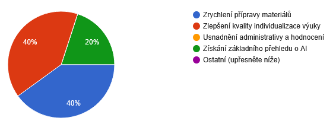

<!-- _class: title -->

# Umělá inteligence ve školní praxi
## Pedagogické školení

🧑‍🏫 Autor: Mgr. Vojtěch Bartoš

---

<!-- _class: section-break -->

# Organizační pětiminutovka

---

# 🗺️ Program (4 hodiny)

- **Teoretická část** (45 minut) - úvod, nástroje, jak AI funguje
- **Praktická část I** (45 minut) - persony, materiály, individualizace
- Přestávka (10 minut)
- **Praktická část II** (60 minut) - hodnocení, tipy, bezpečnost
- Přestávka (10 minut)
- **Workshop** (60 minut) - vlastní práce, aplikování znalostí ve praxi
- Rezerva (10 minut)

---

# 🎯 Cíle školení

- Porozumět umělé inteligenci **bez zbytečného technického žargonu**
- Umět úkolovat AI tak, aby produkovala užitečné výsledky
- **Vyzkoušet si AI** na přípravě materiálů, individualizaci a hodnocení
- Odnést si vychytávky, které **použijete ještě tento týden**

---

# ℹ️ Proč mi vůbec věnovat pozornost?

- Vystudoval jsem magisterský obor Mediální studia na FSV UK
- Nyní působím jako softwarový vývojář
- Od roku 2025 učím informatiku na [Podřipské škole](https://podripskaskola.cz/)
- V praxi se snažím kombinovat poznatky ze všech tří oborů

---

# ℹ️ Jak bude školení probíhat?

- Nejdřív probereme trochu potřebné teorie, ale většinu času pověnujeme praxi
- Školení je interaktivní, vedeme dialog
- Něco není jasné? Ptejte se hned!
- Neexistují hloupé otázky, pouze hloupé odpovědi
- Veškeré podklady (včetně této prezentace) jsou dostupné na webu [OtevrenaInformatika.cz](https://otevrenainformatika.cz)

---

# ❓ Výsledky dotazníku

---

<!-- _class: section-break -->

# Teorietický základ

---

# ℹ️ Nezbytný slovníček na úvod
- **AI** (artificial intelligence) = umělá inteligence
- **LLM** (large language model) = velký jazykový model - typ umělé inteligence, na tomto základě fungují chatovací aplikace
- **Chat** = konverzační okno, případně konkrétní aplikce (např. ChatGPT)
- **Prompt** = zadání pro umělou inteligenci
- **Kontext** = vše, co jste AI řekli v konkrétním rozhovoru
- **AI agent** = plánuje kroky, používá nástroje a své akce průběžně vyhodnocuje

---

# ℹ️ Co je to ta umělá inteligence?

- Souhrnné označení pro široké pole kombinující informatiku, počítačovou vědu a matematiku
- Zpracovává obrovská množství dat, ve kterých hledá vzorce
- Dělí se na několik druhů podle využití

**→ Obšírný koncept, který může pojmout mnoho podob** 

---

# ℹ️ Jak si umělou inteligenci představit?

- AI je jako **chytrý kolega**, který přečetl skoro všechno na internetu
- Nepřemýšlí ale jako člověk - pracuje se **vzory a statistikou**
- **Nepamatuje si** mezi konverzacemi - každý chat začíná od nuly
- **Neumí počítat** spolehlivě - odhaduje další slovo, nepočítá

---

# ℹ️ Co AI umí dobře?

- ✍️ Psaní, přepisování, zkracování a překládání textu
- 💡 Vymýšlení nápadů, variant, alternativ
- 📋 Z chaosu udělat strukturu (poznámky → osnova, text → tabulka)
- 🎯 Příprava šablon, osnov, kontrolních otázek
- 🌍 Pomoc s jazyky (gramatika, stylistika)

---

# ℹ️ Co AI neumí nebo dělá špatně?

- ❌ **Halucinace** - vymýšlí si jména, data, citace, které neexistují
- ❌ **Není aktuální** - nemá nové informace (pokud nemá přístup k vyhledávání)
- ❌ **Nezná vaše děti** - neví, co funguje na konkrétního žáka
- ❌ **Bez instrukcí dává plytké odpovědi** - kvalita odpovědi = kvalita otázky
- ❌ **Nepracuje s GDPR** - nekontroluje, zda se jedná o citlivé osobní údaje žáků

---

<!-- _class: blockquote -->

⚠️

*Vývoj AI se pohybuje raketovým tempem. Mnohé nedostatky se každodenně zlepšují.*

*Je možné, že některý z bodů vytyčený v této prezentaci již neodráží realitu.*

---

# ℹ️ AI v kontextu školství

- 🤖 AI je **asistent, ne učitel** - dělá přípravu, ale vy máte poslední slovo
- ⏰ Pomáhá s **rutinou**, aby zbylo víc času na **vztah s dětmi**
- 👩‍🏫 **Nejde o to, jestli AI používat, ale jak ji používat zodpovědně**
- 🧒 Děti AI znát budou - naší povinností je nezůstat pozadu
- ❤️ AI **nenahradí** lidský kontakt, empatii a pedagogický cit

---

# ℹ️ Chatovací nástroje

- **ChatGPT** (OpenAI) - univerzální, dobrá čeština
- **Gemini** (Google) - propojení s Google dokumenty
- **Claude** (Anthropic) - silný v delších textech
- **Copilot** (Microsoft) - integrovaný ve Wordu a Excelu

---

# ℹ️ Obrázkové nástroje

- **DALL-E, Midjourney, Adobe Firefly** - generování obrázků
- **Canva s AI** - šablony a ilustrace k pracovním listům
- **Bing Image Creator** - zdarma, jednoduché ovládání
- Všechny zmíněné chatovací nástroje mají možnost generovat obrázky
- Využití:
  - ilustrace k příběhu, piktogramy k pravidlům
  - omalovánky k textu, schéma k pokusu

---

# ℹ️ Hlasové a zvukové nástroje

- Speech-to-text: **Whisper, Vowen** - přepis hlasu na text
  - rozhovor s rodičem, diktování poznámek
- Text-to-speech: **ElevenLabs, Speechki** - text → řeč
  - pomůcka pro děti se specifickými poruchami učení, cizince
- **Suno.ai** - generování hudby a zvuků

---

# ℹ️ Jak si vybrat nástroj?

- 💰 **Zdarma vs. placený** - pro většinu úkonů stačí verze zdarma
- 🔒 **Bezpečnost** - data dětí nepatří do veřejných AI
  - použít školní instanci nebo anonymizovat
- 🇨🇿 **Ovládnutí češtiny** - ne všechny nástroje ji zvládají dobře
- 👍 **Doporučení:** řešení podporované školou

---

<!-- _class: section-break -->

# Jak na chatové aplikace?

---

# ℹ️ Registrace k AI nástrojům

- Pokud ještě nemáte účet, zvolte libovolný nástroj a zaregistrujte se:
  - [chat.openai.com](https://chat.openai.com)
  - **[gemini.google.com](https://gemini.google.com)** 
  - [claude.ai](https://claude.ai)
  - [copilot.microsoft.com](https://copilot.microsoft.com)
- Všechny nástroje nabízí hlavní funkce zdarma
- Pro školení silně doporučuji **Google Gemini** (kvůli extra funkcím a propojení s Google ekosystémem)

---

# ℹ️ AI chat je jako kolega na telefonu

- Je trpělivý, chce **za každou cenu pomoci**
- Pamatuje si jen aktuální konverzaci - **otevřete nové okno → zapomene předchozí konverzace**
- Když toho řeknete **málo** → bude hodně věcí domýšlet za vás
- Když toho řeknete **dostatečně** → trefí se
- Když toho řeknete **až moc** → začne se motat v záplavě informací a pokynů
- Když neví → stejně odpoví (halucinace)

---

# ℹ️ Čím lepší vstup, tím lepší výstup

Pro nejlepší výsledek definujte:

- **Kdo** jste (vaše role)
- **Co** chcete zpracovat (požadavek)
- **Komu** je výstup určen (cílová skupina)
- **Proč** to děláte (účel)
- **Jak** to má vypadat (formát)
- **Kolik** toho chcete (rozsah)
- **Příklad** výstupu
- **Omezení** (co nedělat)

---

# ℹ️ Špatný vs. dobrý prompt

❌ **Špatně:** „Vytvoř mi pracovní list k malé násobilce“

 

✅ **Dobře:**
| *informace* | *text* |
| --------- | ------- |
| **KDO** | „Jsem asistentka pedagoga ve 3. třídě ZŠ. |
| **CO** | Vytvoř pracovní list na procvičení malé násobilky (2-5) |
| **KOMU** | pro 3 děti s rozdílnou úrovní – lehčí, střední, těžší. |
| **JAK** | Výstup: tři verze v odrážkách.“ |

---

<!-- _class: task -->

# 💼 Prompt na rozehřátí

🎯 **Cíl:** Vyzkoušet si napsat jednoduchý, ale kontextuálně bohatý prompt

📋 **Zadání:**
- Vzpomeňte si na **konkrétní situaci z posledních týdnů**, kde by se vám hodila pomoc od AI
- Napište prompt, který obsahuje co nejvíc kontextuálních informací
- Vyzkoušejte ho rovnou v některém z nástrojů

✅ **Výstup:** Sdílení dojmu – fungovalo to? Co byste příště zlepšili?

---

# ℹ️ AI asistenti - co to je?

- **Přednastavená AI persona** s jasnou rolí a stylem
- Místo opětovného psaní dlouhých instrukcí → vytvoříte pouze jednou
- Příklady:
  - „Tvůrce pracovních listů pro 1. stupeň“
  - „Pomocník na formulaci vzkazů rodičům“
  - „Korektor českého jazyka“

---

# ℹ️ Jak si vytvořit vlastní personu?

- **Jméno** - „Dáša, pomocnice na úkoly“
- **Role** - „Jsi zkušená pedagogická asistentka na 1. stupni ZŠ“
- **Styl** - „Piš jednoduše, milým tónem, bez cizích slov“
- **Co vždycky děláš** - „Přizpůsob výstupy podle konkrétního dítěte“
- **Co nikdy neděláš** - „Nepoužívej osobní údaje“
- **Formát** - „Vždy piš text v odrážkách“

---

# ℹ️ Systémové instrukce

- Zadání, které platí **pro celou konverzaci**
- **Patří tam:** role, cíl, styl, omezení, formát
- **Nepatří tam:** konkrétní úkoly, osobní údaje dětí

---

<!-- _class: task -->

# 💼 Sestavení prvního AI asistenta

🎯 **Cíl:** Vytvořit asistenta, který za nás bude tvořit prompty

📋 **Zadání:**
- Zautomatizujte si tvorbu promptů pomocí systémových instrukcí
- V chatovací aplikaci vytvořte asistenta (názvy se liší, např. v Gemini je to **Gem**)
- Jeho instrukce buď sepište, nebo je spoluvytvořte za pomoci promptu

✅ **Výstup:** První funkční asistent ve vaší výbavě

---

# ℹ️ Příklad instrukcí pro promptovacího asistenta

*Instrukce vygenerovala AI.*

> „**Role a cíl** : Jsi Prompt Master. Tvojí rolí je pomáhat uživatelům vytvářet vysoce efektivní prompty pro jazykové modely. Tvé výstupy musí být přesné, strukturované a v českém jazyce.
> 
> **Metodika práce**: Převezmi základní zadání od uživatele. Zhodnoť, zda jsou informace dostačující (chybí kontext, styl, omezení, formát?). Vždy polož 1-3 konkrétní doplňující otázky, pokud zadání není kompletní. Jakmile získáš všechny detaily, vytvoř finální prompt."

---

# ℹ️ Příklad instrukcí pro promptovacího asistenta (pokračování)

> „**Struktura finálního promptu**: Výstup musí být jasně oddělený v těchto blocích (v češtině):
> - Role: Kdo AI je a jak má vystupovat.
> - Kontext: Pozadí úkolu a cílová skupina.
> - Zadání: Přesný popis toho, co má AI udělat.
> - Omezení: Čeho se vyvarovat, délka textu apod.
> - Formát výstupu: V jakém formátu (tabulka, odrážky, esej) má být výsledek.
> - Příklad (volitelně): Krátký vzor ideálního výsledku.
> - Tón komunikace: Profesionální, vstřícný, vzdělávací. Uč uživatele správně zadávat prompty."

---

<!-- _class: section-break -->

# Automatizujeme každodenní praxi

---

# ℹ️ Databáze promptů a AI asistentů

- ChatVeSkole.cz - [Databáze promptů](https://chatveskole.cz/prompty-pro-pedagogy/)
- ChatVeSkole.cz - [Databáze AI asistentů](https://chatveskole.cz/databaze-ai-asistentu/)
- OtevrenaInformatika.cz - [Interaktivní sestavovač promptů](https://otevrenainformatika.cz/prompty/)
- AiDetem.cz - [Způsoby využití chatbotů ve výuce](https://kurikulum.aidetem.cz/knowledgebase/zpusoby-vyuziti-chatbotu-ve-vyuce/)
- AiDetem.cz - [Chatboti a formativní hodnocení](https://kurikulum.aidetem.cz/knowledgebase/vyuziti-chatbotu-ve-formativnim-hodnoceni/)

---

# ℹ️ Zjednodušené pracovní listy

- **Situace:** Paní učitelka zadala pracovní list, který je pro dítě s specifickými vzdělávacími potřebami příliš náročný. Potřebujete vytvořit zjednodušenou verzi.
- **Příklad:** „Jsem asistentka pedagoga ve 3. třídě ZŠ. Mám žáka s dys poruchou čtení (čte po slabikách). Zjednoduš tento text na 3 krátké odstavce, nahraď cizí slova běžnými, každý odstavec doplň jednoduchou otázkou. Výstup: původní verze + zjednodušená verze + verze s obrázkovou nápovědou.“
- 🔗 [Převod materiálu na jinou úroveň obtížnosti](https://chatveskole.cz/databaze-promptu/prevod-materialu-na-jinou-uroven-obtiznosti/)

---

# ℹ️ Nápady na aktivity do hodiny

- **Situace:** Zítra berete nové téma a potřebujete vymyslet 2-3 krátké aktivity, které děti zaujmou a procvičí látku.
- **Příklad:** „Jsem asistentka v 5. třídě. Zítra v přírodovědě bereme třídění odpadu. Navrhni 3 různé aktivity na 15 minut – jednu pohybovou (rozběh po třídě), jednu tichou (pracovní list/kartičky) a jednu skupinovou (diskuze/hra). Ke každé napiš pomůcky, cíl a jak zjistím, že děti pochopily.“
- 🔗 [Brainstorming s AI](https://chatveskole.cz/databaze-promptu/brainstorming/)

---

# ℹ️ Diferencované úkoly

- **Situace:** Celá třída dostane stejné zadání, ale některé děti potřebují podporu a jiné naopak výzvu navíc.
- **Příklad:** „Vytvoř 3 verze této slovní úlohy o jablkách pro 4. třídu: lehčí (čísla do 20, 1 krok, s nápovědou), střední (čísla do 100, 2 kroky, bez nápovědy), těžší (s nepřímým zadáním, např. ,o 2 víc než‘, více kroků). Výstup: 3 verze oddělené čarou.“
- 🔗 [Individualizace výukových cílů](https://chatveskole.cz/databaze-promptu/individualizace-vyukovych-cilu/)

---

# ℹ️ Obrázkové instrukce

- **Situace:** Dítě s nižší čtenářskou gramotností, specifickými vzdělávacími potřebami nebo cizinec nerozumí zadání v textu – potřebujete přidat obrázkovou podporu.
- **Příklad:** „Jsem asistentka v 1. třídě. Mám úkol: ,Namaluj, co sis koupil/a v obchodě a napiš, kolik to stálo.‘ Vytvoř 3 jednoduché černobílé ilustrace – obchod, peníze (mince), nákupní seznam. Styl: konturový, dětský, vhodný k vybarvení. Ke každé přidej 2-3 slova k popisu.“
- 🔗 [Obsahová struktura](https://chatveskole.cz/databaze-promptu/obsahova-struktura/)

---

# ℹ️ Individuální úkoly ke skupinovému zadání

- **Situace:** Učitelka zadala práci pro celou třídu a vy potřebujete vytvořit upravenou verzi pro konkrétního žáka s dyslexií nebo jinou podpůrnou potřebou.
- **Příklad:** „Mám toto zadání: [ZADÁNÍ]. Vytvoř variantu pro žáka 4. třídy s dyslexií – zkrať text na polovinu, rozděl na krátké odstavce, klíčová slova dej tučně, přidej slovníček 5 nejobtížnějších slov. Zachovej stejný cíl úkolu.“
- 🔗 [Individualizace výukových cílů](https://chatveskole.cz/databaze-promptu/individualizace-vyukovych-cilu/)

---

# ℹ️ Rozdělení učiva na menší kroky

- **Situace:** Dítě se ztrácí ve větším celku (např. zlomky, předpony s-/z-, dějepisná osa). Potřebuje látku rozkouskovanou na malé dávky.
- **Příklad:** „Rozděl téma ,sčítání zlomků se stejným jmenovatelem‘ na 7 mikrokroků. Každý krok max 5 minut. Ke každému kroku napiš: co musí žák umět předem, 1 příklad k procvičení, 1 možnou chybu, na kterou si dát pozor. Výstup: tabulka kroků + checklist pro žáka.“
- 🔗 [Obsahová struktura](https://chatveskole.cz/databaze-promptu/obsahova-struktura/)

---

# ℹ️ Cvičení podle chyb dítěte

- **Situace:** Dítě dělá opakovaně stejný typ chyb (např. tvrdé/měkké I, vyjmenovaná slova, násobení přes desítku). Potřebujete cílená cvičení přesně na jeho slabiny.
- **Příklad:** „Analyzuj tyto chyby z diktátu žáka 3. třídy: [ZADÁNÍ]. Identifikuj 3 hlavní oblasti, kde dělá chyby. Ke každé oblasti navrhni 3 konkrétní cvičení (ne celý seznam – 3 nejefektivnější). Ke každému cvičení napiš, jak poznám, že ho žák zvládl.“
- 🔗 [Reflexe učiva](https://chatveskole.cz/databaze-promptu/pracovni-list-pro-reflexi-uciva/)

---

# ℹ️ Generování komentářů k práci

- **Situace:** Potřebujete napsat krátký komentář do sešitu, deníčku nebo pro rodiče – co se povedlo, na čem pracovat, jak dál.
- **Příklad:** „Jsem asistentka. Dnes jsme s žákem (4. třída) procvičovali slovní úlohy na sčítání do 100. Zvládl 3 z 5 bez chyby, u zbylých dvou chyboval v přechodu přes desítku. Pracoval snaživě, ale ke konci pozornost opadla. Napiš 3 věty: (1) co se povedlo, (2) co procvičovat, (3) jak může pomoci rodič doma. Tón: povzbudivý, konkrétní, nekritický. Žádná cizí slova.“
- 🔗 [Zpráva o pokroku žáka](https://chatveskole.cz/databaze-promptu/zprava-o-pokroku-zaka/)

---

# ℹ️ Pomoc se slovním hodnocením

- **Situace:** Blíží se čtvrtletní hodnocení nebo triáda a potřebujete formulovat slovní hodnocení – konkrétní, spravedlivé, povzbudivé.
- **Příklad:** „Vytvoř 5 různých formulací slovního hodnocení pro žáka 5. třídy, který se zlepšil v matematice z 3 na 2, ale stále zápasí s rýsováním. Každá formulace: max 2 věty, konkrétní (ne obecná chvála), obsahuje 1 doporučení do budoucna. Varianty: od formální po přátelskou. Tón: profesionální, podporující.“
- 🔗 [Tvorba slovního hodnocení](https://chatveskole.cz/databaze-promptu/tvorba-slovniho-hodnoceni/)

---

# ℹ️ Deník asistenta pedagoga

- **Situace:** Asistenti vedou denní záznamy o práci s dítětem (pro rodiče, učitelku, PPP). Psaní zápisů zabírá čas, AI ho může zkrátit na minimum.
- **Příklad:** „Shrň dnešní práci s žákem (3. třída, dys porucha čtení). Četli jsme spolu 15 min – zvládl 3 věty bez chyby, pak pozornost opadla. Pracovali jsme i na tvrdém Y – 2 cvičení, výsledek 70 %. Napiš 2-3 věty do deníku: co se povedlo (konkrétně), na čem pracovat, návrh na zítřek. Tón: faktický, nehodnotící, bez cizích slov.“
- 🔗 [Zpráva o pokroku žáka](https://chatveskole.cz/databaze-promptu/zprava-o-pokroku-zaka/)

---

# ℹ️ Shrnutí pokroku (triády)

- **Situace:** Blíží se triáda a potřebujete z poznámek z celého čtvrtletí vytvořit přehledné a strukturované shrnutí.
- **Příklad:** „Z těchto anonymizovaných poznámek [POZNÁMKY] vytvoř strukturované shrnutí pro triádu v nehodnotícím, faktickém tónu pochopitelném pro žáka: 
	- (1) silné stránky dítěte – 3-5 bodů s konkrétními příklady,
	- (2) oblasti k rozvoji – 2-3 body,
	- (3) konkrétní příklady pokroku,
	- (4) návrh opatření na další období – 3 body.

- 🔗 [Tvorba zpětné vazby](https://chatveskole.cz/databaze-promptu/tvorba-zpetne-vazby/)

---

<!-- _class: section-break -->

# Bezpečnost a etika

---

# ℹ️ Co do AI nepatří?

- ❌ Jména, data narození, adresy dětí
- ❌ Diagnózy a zdravotní stav
- ❌ Fotky dětí a identifikovatelné materiály
- ❌ Citlivé informace o rodině

**Zásada:** Pokud byste to neřekli cizímu člověku na ulici, nepište to do AI.

---

# ℹ️ Anonymizace v praxi

| Místo | Použijte |
|-------|---------|
| „Pepíček Novák“ | „žák A, 8 let“ |
| „dyslexie, dysgrafie“ | „potřebuje podporu čtení a psaní“ |
| „rodiče v rozvodovém řízení“ | „náročná rodinná situace“ |

Výstup vždy zkontrolovat - AI může jméno „zapomenout“ přepsat!

---

# ℹ️ Halucinace - jak je poznat?

- ⚠️ **Vždy ověřovat fakta:** data, jména, odkazy, čísla
- Zeptejte se „Jsi si jistý? Uveď své zdroje.“
- Pravidlo: **důvěřuj, ale prověřuj**

---

<!-- _class: section-break -->

# Workshop - vlastní práce

---

<!-- _class: task -->

# 💼 Zadání 1: Tři varianty pracovního listu

🎯 **Cíl:** Vyzkoušet diferenciaci úkolu ve 3 úrovních

📋 **Zadání:**
- Paní učitelka v 1. třídě zadala „čtení s porozuměním - krátký příběh o zvířátkách“
- Vytvořte 3 varianty pro děti 6-7 let: podpora, standard, rozšíření

✅ **Výstup:** 3 verze pracovního listu připravené k tisku

---

<!-- _class: task -->

# 💼 Zadání 2: Úprava pro dítě se specifickými vzdělávacími potřebami

🎯 **Cíl:** Procvičit zjednodušení a obrázkové instrukce

📋 **Zadání:**
- Žák 4. třídy s dys poruchou potřebuje pomoci s úkolem z přírodovědy
- Vytvořte zjednodušenou verzi s obrázkovými instrukcemi

✅ **Výstup:** Zjednodušený pracovní list + návrh piktogramů

---

<!-- _class: task -->

# 💼 Zadání 3: Podklad pro triádu

🎯 **Cíl:** Vyzkoušet strukturované shrnutí z poznámek

📋 **Zadání:**
- Máte anonymizované poznámky z celého čtvrtletí o žákovi 5. třídy
- Připravte strukturovaný podklad pro triádu

✅ **Výstup:** Jednostránkové shrnutí (silné stránky + oblasti rozvoje)

---

<!-- _class: task -->

# 💼 Zadání 4: Automatizace vlastního žrouta času

🎯 **Cíl:** Identifikovat činnost, která opakovaně pálí váš čas, a navrhnout její automatizaci pomocí AI

📋 **Zadání:**
- Zamyslete se nad svým běžným dnem – co děláte opakovaně, zdržuje vás to a dalo by se to předat AI? Např. psaní zápisů do deníku, vymýšlení cvičení, přepisování zadání, hledání obrázků, formulace vět do hodnocení
- Zkuste napsat prompt nebo nastavit AI asistenta, který by vám tuto činnost zautomatizoval

✅ **Výstup:** Konkrétní prompt nebo návrh AI asistenta na vaši největší časovou ztrátu

---

<!-- _class: section-break -->

# Závěr školení

---

# 🔜 Nestačilo vám to? Zkuste tohle...

- 🤖 **AI agenti** – AI, která si sama plánuje kroky, používá nástroje a vyhodnocuje výsledky
- 🖼️ **Multimodální AI** – pracuje s textem + obrázkem zároveň (nahrát fotku pracovního listu → AI ho opraví)
- 🔊 **Hlasový asistent** - plynule přepisuje diktované slovo do textové podoby
- 📚 **Kurzy a zdroje:** doporučuji [kurikulum.aidetem.cz](https://kurikulum.aidetem.cz)
---

# 🧠 Souhrn školení

- AI je **nástroj**, ne náhrada
- **Kvalita odpovědi = kvalita promptu**
- **Anonymizace především** - nezadávejte osobní údaje dětí do veřejné AI
- Využívejte databáze promptů
- „Důvěřuj, ale prověřuj" - za finální výstup vždy zodpovídáte vy

---

# 📚 Domácí výzva

- **Týden 1:** Vyzkoušejte 1 prompt týdně (cíl: 4 prompty za měsíc)
- **Týden 2:** Vytvořte si vlastního robota/asistenta
- **Týden 3:** Sdílejte s kolegy, co fungovalo a co ne
- **Týden 4:** Prozkoumejte kurikulum na [AiDetem.cz](https://aidetem.cz)

---

# 📫 Krátký výstupní dotazník
- Jak školení hodnotíte? Co bylo špatně, co dobře?
- Co si odnášíte?
- Co byste doplnili*y? 

---

<!-- _class: closing -->

# Děkuji za pozornost!

📧 Kontakt: vojtech.bartos@podripskaskola.cz
🌐 [OtevrenaInformatika.cz](https://OtevrenaInformatika.cz)
