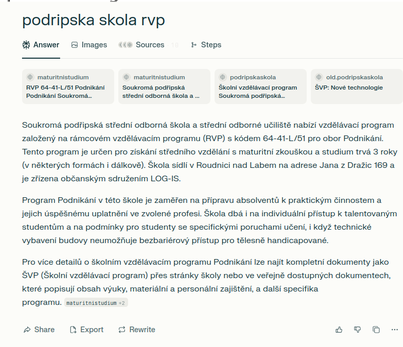
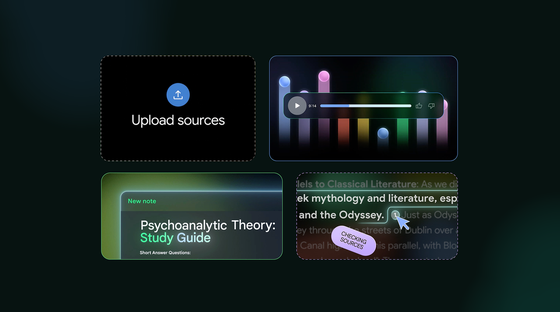
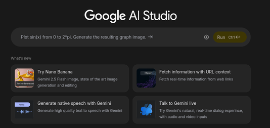
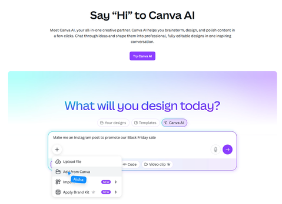

<!-- _class: title -->

# Umělá inteligence

## Pomocník, ne věštec

🧑‍🏫 Autor: Mgr. Vojtěch Bartoš  
©️ Licence: CC BY-NC-SA

---

# 🎯 Cíle lekce

- vysvětlíte rozdíl mezi AI, daty a modelem
- poznáte, co umí a neumí jazykový model
- naučíte se tvořit lepší prompty
- ověříte odpověď AI ve spolehlivých zdrojích
- seznámíte se s různými nástroji využívajícími AI

---

# ℹ️ Co je to ta umělá inteligence?

- technologie, která hledá vzorce v datech
- podle nich vytváří odhad, doporučení nebo obsah
- dobře řeší vymezený úkol, ne „všechno jako člověk“ (zatím)
- výsledek závisí na datech, zadání a kontrole člověka

---

# ℹ️ Kde se s AI setkáme?

- chatovací asistenti a generování obsahu
- doporučení videí a hudby
- navigace a odhad dopravy
- rozpoznání spamu nebo obličeje
- překlad, diktování a titulky

---

# ℹ️ Jak rozlišíme skutečnou AI?

- **autonomie**: AI dokáže jednat samostatně, nejen podle přesně daného scénáře
- **adaptace**: učí se z dat nebo zkušeností, dokáže zlepšovat výkon
- **generalizace**: zvládne situace, které neviděla přesně v tréninku

---

# ℹ️ Automatizace × AI

| Automatizace | AI |
|---|---|
| Postup podle pevných pravidel | Hledá vzorce v datech |
| „Když A, udělej B“ | Odhaduje vhodný výsledek |
| Např. časovač světla | Např. filtr spamu |

---

# ℹ️ Data nejsou neutrální

- data určují, co se model může naučit
- chybná nebo neúplná data vedou k chybným výstupům
- data mohou nést stereotypy a předsudky

---

<!-- _class: task -->

# 💼 Úkol: Modely a morální volby

🎯 **Cíl:** pochopit problematiku a moralitu vstupních dat modelů

📋 **Zadání:**

- běžte na [moralmachine.net](https://www.moralmachine.net/)
- nejdříve si projděte hrou sami
- poté projdeme hru společně

✅ **Výstup:** diskuze

---

# ℹ️ Od dat k odpovědi

- **data**: ukázky, ze kterých se hledají vzorce
- **trénink**: nastavování modelu podle dat
- **model**: naučený matematický nástroj
- **prompt**: vaše instrukce pro model
- **kontrola**: odpovědnost zůstává na člověku

---

<!-- _class: task -->

# 💼 Úkol: Trénování modelu

🎯 **Cíl:** vytrénovat primitivní model

📋 **Zadání:**

- běžte na [teachablemachine.withgoogle.com](https://teachablemachine.withgoogle.com)
- vyberte si jednu z možností trénování (obrázek, zvuk, póza)
- vytrénujte model a vyzkoušejte výsledek

✅ **Výstup:** diskuze

---

# ℹ️ AI podle rozsahu úkolu

- **úzká AI:** řeší konkrétní úlohu, například doporučení obsahu nebo rozpoznání řeči
- **obecná AI:** hypotetický systém se schopnostmi napříč úkoly na lidské úrovni
- **superinteligence:** spekulativní představa, nikoli současná technologie

> Většina nástrojů, které dnes používáme, patří k úzké AI.

---

# ℹ️ Co je LLM?

- **LLM** znamená velký jazykový model (*Large Language Model*)
- pracuje s textem a často i s obrázky, zvukem či soubory
- z kontextu navrhuje pravděpodobné pokračování
- umí vytvářet text, shrnutí, překlad, návrh i kód

> LLM není vyhledávač ani autorita. Je to generátor odpovědi podle vzorců.

---

# ℹ️ Chytří asistenti využívající LLM

- ChatGPT.com
- Claude.ai
- Grok.com
- ollama.com

> Dnes už můžete na výkonějších počítačích provozovat modely lokálně.

---

# ℹ️ Co se může pokazit?

- **halucinace:** vymyšlený údaj, citace nebo odkaz
- **zkreslení:** přejímání nerovností z dat a kontextu
- **zastaralost:** informace nemusí být aktuální
- **nejasné zadání:** obecná otázka vede k obecné odpovědi

---

# ℹ️ Základy dobrého promptu

> Prompt = instrukce pro jazykový model

1. **role:** Určete, v jaké roli má AI vystupovat.
2. **úkol:** Co má vzniknout?
3. **kontext:** Pro koho a v jaké situaci?
4. **formát:** Tabulka, body, délka, jazyk?

> S dobrým promptem vám pomůže... jiný prompt!

---

<!-- _class: task -->

# 💼 Úkol: Výměna rolí v promptu

🎯 **Cíl:** naučit se používat role a specifikovat tón výstupu

📋 **Zadání:**

- použijte AI chatbot (LLM) vaší volby
- zadejte stejný úkol, ale postupně a s jiným kontextem, pokaždé v novém okně, např:
	- „Vysvětli, jak funguje počítačová síť.“
	- „Chovej se jako naštvaný pirát a vysvětli, jak funguje počítačová síť.“
	- „Vysvětli, jak funguje síť, jako bys to vysvětloval pětiletému dítěti.“

✅ **Výstup:** diskuze

---

# ℹ️ Prompting je rozhovor, ne kouzlo

- začněte jednoduchým návrhem
- doplňte chybějící kontext
- požádejte o jiný formát nebo úroveň vysvětlení
- porovnejte dvě varianty
- před použitím výsledek zkontrolujte

---

# ℹ️ Sebevědomá odpověď ≠ pravda

- AI může napsat nesprávný údaj plynule a bez varování
- zdroj uvedený AI nemusí existovat nebo podporovat tvrzení
- důležité informace porovnávejte alespoň se dvěma zdroji
- u čísel, práva, zdraví a zpráv hledejte původní zdroj

---

<!-- _class: task -->

# 💼 Úkol: AI a práce s fakty

🎯 **Cíl:** uvědomit si, že AI si dokáže přesvědčivě vymýšlet (halucinovat)

📋 **Zadání:**

- vymyslete chyták - otázku na něco, co neexistuje, nebo logický nesmysl
- např. „Kdo vyhrál mistrovství světa v podvodním hokeji v Roudnici nad Labem v roce 2024?"

✅ **Výstup:** diskuze

---

# ℹ️ Autorské právo a férovost

- AI výstup může připomínat existující dílo
- kontrolujte licence obrázků, textů i zdrojových dat
- nepředávejte neupravený výstup AI jako vlastní práci

---

# ℹ️ Kdo odpovídá za výsledek?

- AI nenese odpovědnost za odevzdaný text ani rozhodnutí
- odpovědnost má člověk, který výstup použije
- důležitá rozhodnutí vyžadují lidskou kontrolu
- „AI to napsala“ není omluva

---

<!-- _class: task -->

# 💼 Úkol: AI a práce s fakty

🎯 **Cíl:** ověříte jeden faktický výrok vytvořený AI

📋 **Zadání:**

- ve skupině zvolte jeden konkrétní výrok z odpovědi AI
- najděte dva spolehlivé zdroje, z nichž jeden je primární nebo institucionální
- rozhodněte: platí / neplatí / nelze ověřit

✅ **Výstup:** diskuze

---

# ℹ️ AI jako tvůrčí spolupracovník

- nápady a varianty názvu
- osnova textu nebo prezentace
- jazyková úprava a vysvětlení
- návrh plakátu, ilustrace či rozhraní
- kontrolní otázky před odevzdáním

> AI pomáhá navrhovat. Vy vybíráte, upravujete a ručíte za výsledek.

---

# ℹ️ Tipy na AI nástroje - Perplexity.com

- AI vyhledávač s citacemi
- vložte váš článek a požádejte o ověření faktů

---

# ℹ️ Tipy na AI nástroje - NotebookLM.google.com

- AI asistent pro práci s dokumenty a poznámkami;
- lze se doptávat na informace z vámi poskytnutých zdrojů;
- umí generovat podcast z vašeho kontextu - vložte článek a zkuste.

---

# ℹ️ Tipy na AI nástroje - Google AI Studio

- umí všechno jako předchozí aplikace, ale navíc také můžete spolu plynně konverzovat (přes audio i video)

---

# ℹ️ Tipy na AI nástroje - Canva AI

- vibe coding aplikace - navrhněte vlastní appku nebo web
- přihlaste se do Canvy pomocí osobního účtu (ne studentského):
	- studentský účet nedisponuje funkcionalitou, kterou potřebujeme

---

<!-- _class: task -->

# 💼 Vibecoding s AI

🎯 **Cíl:** s Canva AI vytvořte vlastní aplikaci nebo web, který řeší nějaký problém

📋 **Zadání:**

- ve dvojici vyberte problém (např. organizace školních akcí, usnadnění učení, podnikatelský nápad, revoluční technologie,…)
- navrhněte řešení - váš produkt/služba/aplikace
- s AI připravte návrh textu, vizuálu nebo jednoduchého prototypu

✅ **Výstup:**
- vibecoded aplikace
- prezentace představující váš nápad (3 slidy: problém, řešení problému, ukázka aplikace)

---

# 🧠 Souhrn výukového bloku

- AI hledá vzorce - neznamená to, že rozumí světu jako člověk
- Dobré zadání obsahuje úkol, kontext, formát a kontrolu
- Přesvědčivá odpověď může být chybná
- Citlivá data do veřejných nástrojů nepatří
- **Vy rozhodujete, ověřujete a nesete odpovědnost.**

---

<!-- _class: closing -->

# Děkuji za pozornost!

🧑‍🏫 Autor: Mgr. Vojtěch Bartoš  
© Licence: CC BY-NC-SA  
Kontakt: [info@otevrenainformatika.cz](mailto:info@otevrenainformatika.cz)  
www.otevrenainformatika.cz
