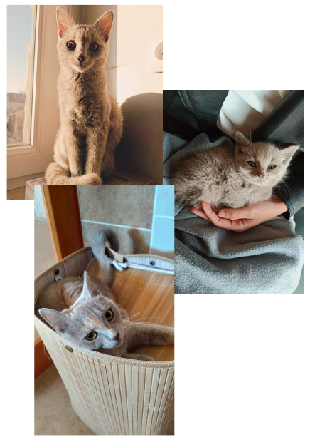
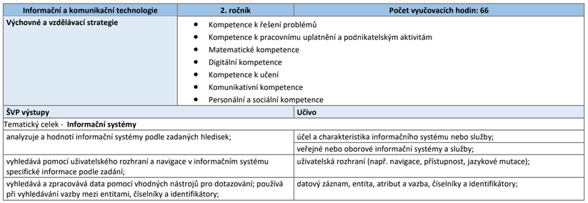
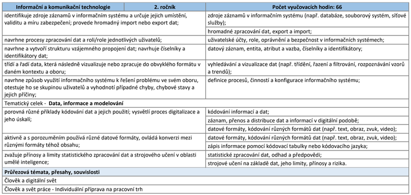

<!-- _class: title -->

# Informační a komunikační technologie
## Úvodní hodina ve 2. ročníku

🧑‍🏫 Autor: Mgr. Vojtěch Bartoš  
© Licence: CC BY-NC-SA

---

# 🎯 Cíle lekce

- krátké vzájemné seznámení
- dohoda o očekáváních a spolupráci
- průzkum zájmů, zkušeností a dovedností
- představení programu 2. ročníku
- výběr doplňkových témat
- přihlášení do Google Classroom

---

# ℹ Kdo vlastně jsem?

- rodilý Roudničák
- původně marketér, dnes programátor
- zajímá mě internet a jeho kultura
- baví mě videohry, programování, podnikání, sport a média
- TikTok nemám, memes sleduji na Instagramu

---

# ℹ Bonusová kočka

---

# ⚡ TikTok × Instagram?

---

# ⚡ Počítač × telefon?

---

# ⚡ Netflix × YouTube?

---

# ⚡ Hry × sociální sítě?

---

# ⚡ Filmy × hudba?

---

# ⚡ Noční sova × ranní ptáče?

---

# ℹ Kdo jste vy?

Představte se krátce a věcně:

- jak se jmenujete a odkud jste
- co je vaše vysněná práce nebo směřování v dospělosti
- jak používáte technologie a k čemu
- jaké máte záliby
- kterou aplikaci nebo web používáte nejčastěji

---

# ℹ Jak bude výuka probíhat?

- povedeme dialog, ne jednostranný výklad
- budeme jednat férově a transparentně
- interaktivita a práce s moderními technologiemi
- program budeme částečně spoluvytvářet
- obě hodiny spojíme do nepřetržité výuky a skončíme o 5 minut dříve
- výukové materiály budou dostupné v Google Classroom

---

# ℹ Počítače a jiná výbava
- o školní výpočetní techniku řádně pečujeme
- **služba zajišťuje klíče** od skříně s počítači:
	- před hodinou vyzvedne klíče a odemkne skříň
	- po hodině zamkne skříň a odevzdá klíče
- klíče (učebna C) jsou dostupné ve sborovně, případně školní kanceláři

---

# ℹ Co bude potřeba splnit?

- docházku alespoň **75 %** odučených hodin
- jednu prezentaci aktuality ze světa IT a médií
- odevzdat alespoň **90 %** prací v Classroomu

---

# ℹ Povinná prezentace

- na téma ze světa IT a médií
- může to být aktualita, představení, rychlý návod, popsání zkušenosti,...
- délka 3 až 5 minut + 5 minut na diskuzi a zpětnou vazbu
- prezentace v Google Slides nebo v Canvě (případně jiný formát)
- **každý student musí prezentaci splnit!**

- příklady: Moje oblíbená aplikace/stránka, představení videohry, shrnutí novinky (Apple Keynote, nové ChatGPT), recenze technologie,...

---

# 🔗 Připojení do Google Classroom

Otevřete Google Classroom, zvolte **Připojit se ke kurzu** a zadejte kód.

# `<kód>`

---

# ℹ Co si odnášíte z 1. ročníku?

- Jak vypadala typická hodina?
- S jakými programy jste pracovali?
- Jaké výstupy jste vytvářeli?
- Které téma vás bavilo nejvíc?
- Co bylo nejtěžší?
- Na co byste chtěli ve 2. ročníku navázat?

---

# ℹ Průzkum vašich zájmů

Zvedněte ruku, pokud:

- máte doma vlastní počítač
- sledujete videa na YouTube nebo hrajete hry
- používáte sociální sítě
- zajímáte se o AI, virtuální realitu nebo 3D tisk
- rádi fotíte, natáčíte nebo tvoříte vlastní média

---

# ℹ Průzkum vašich zkušeností

Kdo už někdy:

- použil chatbota nebo nástroj pro tvorbu obrázků
- pracoval v Excelu nebo Google Sheets
- tvořil grafiku v Canvě, GIMPu nebo jiném nástroji
- napsal kód či jednoduchý program
- instaloval operační systém
- pracoval s více než jedním operačním systémem

---

# ℹ Průzkum vašich dovedností

Kdo umí:

- používat klávesové zkratky
- použít funkci v tabulkovém procesoru
- najít na internetu spolehlivou informaci
- bezpečně sdílet soubor online
- poznat podvodný e-mail nebo dezinformaci
- zabezpečit svůj účet

---

# ℹ Co říká Školní vzdělávací program?

---

# ℹ Co říká Školní vzdělávací program?

---

# ℹ Témata, která můžete ovlivnit

- umělá inteligence a její budoucnost
- bezpečnost na sociálních sítích a kyberbezpečnost
- mediální gramotnost, deepfakes a dezinformace
- užitečné aplikace a weby
- programování, weby a výpočetní hardware
- automatizace, týmová spolupráce a digitální etika
- OSINT, dark web a deep web
- životopis a osobní portfolio

---

# 🔗 Hlasování o doplňujících tématech

Jaká témata nad rámec ŠVP byste rádi probrali? Hlasujte anonymně na *sli.do*:

# `7403762`

---

# 🧠 Souhrn dnešní hodiny

- výuka IKT bude praktická, dialogická a částečně společně plánovaná
- navážeme na vaše zkušenosti z 1. ročníku
- splníte povinné výstupy podle ŠVP
- doplňková témata ovlivníte svými návrhy

---

<!-- _class: closing -->

# Děkuji za pozornost!

🧑‍🏫 Autor: Mgr. Vojtěch Bartoš  
© Licence: CC BY-NC-SA  
www.otevrenainformatika.cz
