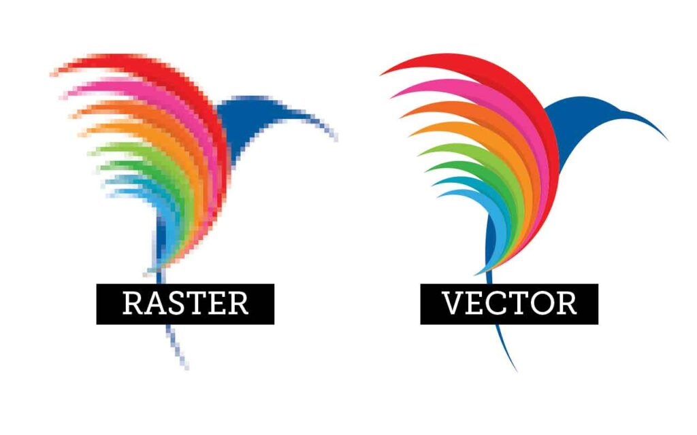
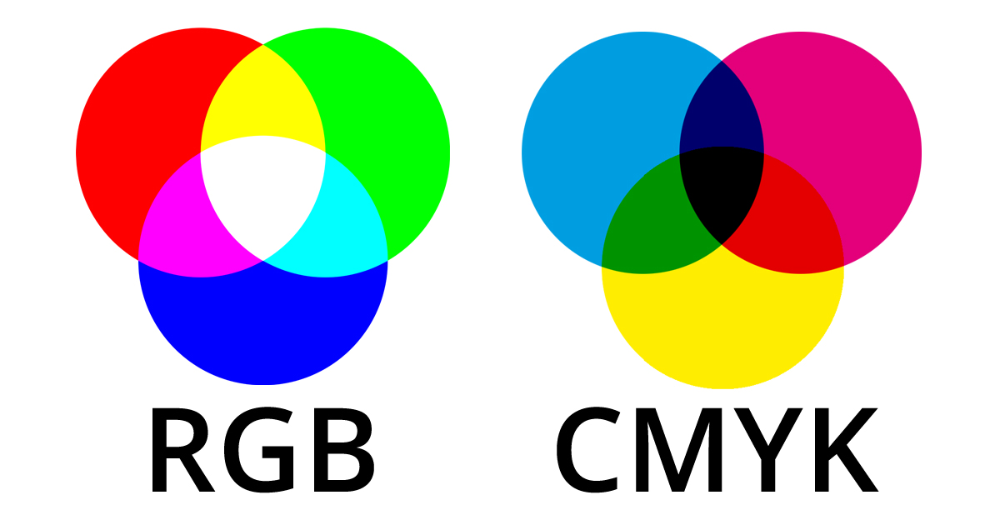

<!-- _class: title -->

# Vizuální identita
## aneb Tvoříme vizuál vlastní značky

🧑‍🏫 Autor: Mgr. Vojtěch Bartoš  
Licence: CC BY-NC-SA

---

# 🎯 Cíle lekce

- pochopit základní principy tvorby vizuální značky (brandu)
- zjistit rozdíl mezi rastrem a vektorem a kdy který formát použít
- prozkoumat možnosti moderní AI při tvorbě grafiky v Canvě
- vytvořit „brand kit“ (sadu vizuálních prvků) pro vlastní projekt

---

# ℹ️ Co je to vizuální identita?

= **soubor grafických prvků**, které definují značku a odlišují ji od konkurence

 

Pilíře:
- **logo**: symbol, který vás reprezentuje
- **barvy**: psychologie barev a emoce
- **typografie**: fonty, které ladí s tématem
- **styl**: sjednocený vzhled příspěvků

---

# ℹ️ Rastr vs. vektor

**Rastr (bitmapa)**

- složen z pixelů
- vhodný pro fotografie
- při zvětšení „kostičkuje“

**Vektor**

- složen z matematických křivek
- vhodný pro loga
- lze zvětšovat bez ztráty kvality

---

# ℹ️ Kdy použít jaký formát?

- **PNG**: rastr, web, loga s průhledným pozadím
- **JPEG**: rastr, fotografie (ztrátová komprese)
- **SVG**: vektor, ikony a loga pro web (ostré na mobilu i 4K)
- **PDF**: obojí, tiskové materiály a prezentace

---

# ℹ️ Barevné modely: RGB vs. CMYK

**RGB** (Red, Green, Blue)

- pro obrazovky
- sčítání světla
- zářivé barvy

**CMYK** (Cyan, Magenta, Yellow, Key)

- pro tisk
- míchání pigmentů
- barvy jsou tlumenější než RGB

---

<!-- _class: task -->

# 💼 Úkol: Tvorba Brand Kitu

🎯 **Cíl**: vytvořit základ vizuální identity pro fiktivní projekt

📋 **Zadání**:

- vyberte si téma (influencer, školní projekt, podnikání, neziskovka, ...)
- vyberte 2 fonty (nadpis + tělo) a 3 barvy (včetně HEX kódů)
- vytvořte logo pomocí geometrických tvarů nebo AI generátoru

✅ **Výstup**:
- brand board = ucelená prezentace spojující všechny prvky

---

# 🧠 Souhrn lekce

- vizuální identita musí být **konzistentní**
- loga tvoříme vektorově
- pro web RGB, pro tisk CMYK
- AI je pomocník, ne náhrada: kontrolujte detaily a autorská práva

---

<!-- _class: closing -->

# Děkuji za pozornost!

🧑‍🏫 Autor: Mgr. Vojtěch Bartoš  
© Licence: CC BY-NC-SA  
Kontakt: [info@otevrenainformatika.cz](mailto:info@otevrenainformatika.cz)  
www.otevrenainformatika.cz